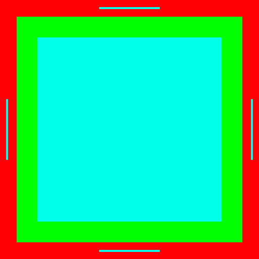

# Edgingo

Edgingo is a Go library for detecting and removing solid-colored edges/borders from images. It supports removing edges from all sides, vertical edges only, horizontal edges only, or individual sides.

## Features

- Remove edges from all sides of an image
- Remove only vertical edges (top/bottom)
- Remove only horizontal edges (left/right)
- Remove edges from specific sides
- Aggressive mode that uses a 10% threshold for edge detection
- Preserves image quality by working with RGBA images

## Installation

```go
go get github.com/yourusername/edgingo
```

## Usage

```go
import "github.com/yourusername/edgingo"

// Load your image
img, _ := png.Decode(file)

// Convert to RGBA if needed
rgba := edgingo.AsRGBA(img)

// Remove all edges
result := edgingo.RemoveAllEdges(rgba, false)

// Remove only vertical edges
result = edgingo.RemoveVerticalEdges(rgba, false)

// Remove only horizontal edges
result = edgingo.RemoveHorizontalEdges(rgba, false)

// Remove specific edge
result = edgingo.RemoveEdge(rgba, edgingo.SideTop, false)

// Use aggressive mode (10% threshold)
result = edgingo.RemoveAllEdges(rgba, true)
```

The second parameter `aggressive` determines whether to use a 10% threshold when detecting edges. When true, it will ignore checking the middle 80% of pixels along each edge.

## Example
Example of removing all edges from an image with aggressive mode enabled.

|Before|After|
|--|--|
|||

## License

See the [LICENSE](LICENSE) file for details.